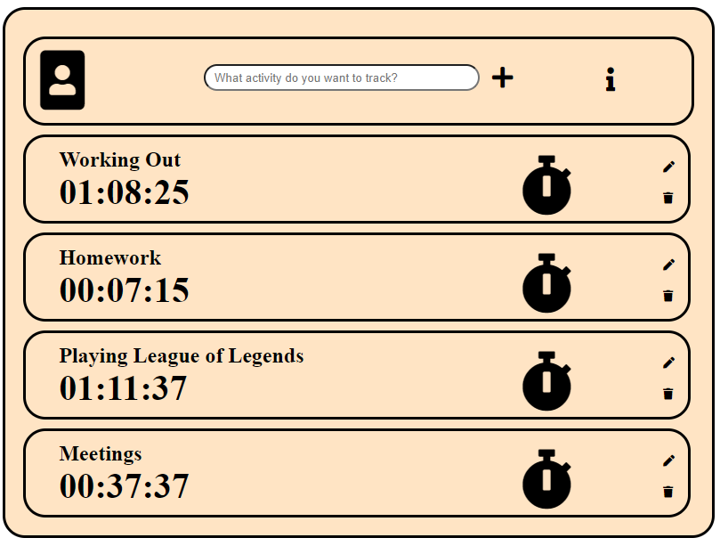

# Time My Life
[Link to Application](https://time-my-life-a576f.web.app/)

## Description
Time My Life is a web application to track different aspects of your life. Create a timer, give it a name, and click the clock to start tracking. Pause the timer by pressing the clock. Press the button again to unpause it. Create as many timers as you want.

## Technologies
- JavaScript
- TypeScript
- Firebase

## How It Works
Each Timer is an object with its own state and behaviour. Hence, every Timer instantiated have its own name, hours, minutes, seconds, paused/unpaused status, and a number of different html elements. Upon the instantiation of a Timer using the "new" keyword, the html elements of the Timer is appended to its parent element. The time itself is tracked by calculating the difference between when the start/stop timer button is clicked and the system time - plus the elapsed time. Although this sounds like a convoluted way to track time, it ensures that the Timers are accurate. My previous attempts at creating a Timer can be found in the folder called "Previous-Attempts." 

# Challenges and Unique Elements
There were a number of challenges. One of my initial problem was how I would "link" HTML elements with a Timer object. Initially I tried to create a unique identifier for the HTML elements and the Timer. If the unique identifier of the HTML elements and the Timer were equal, they were "linked." Turns out the easier method was to create the HTML elements inside the object. 

Another problem was that, when the user clicks the pause button, the Timer didn't stop immediately. Instead it would tick one more second before pausing. The reason was that I had used the setTimeout function which does not "pause" when you click the pause button. The setTimeout function is given an elapsed time and will keep running until done. and the pause effect takes hold. 

The biggest challenge was related to my first few attempts at making sure that the Timers tracked time accurately. Initially,I would start the Timer and everything would be accurate. However, a couple of minutes later there would be a noticeable "time drift" of a second, then two seconds, and so on. This is due to the nature of JavaScript being a single threaded language. This is also why the setTimeout and setInterval functions cannot be entirely trusted. The main thread can only process one set of instruction at a time. Any rendering, user events, and pretty much most program functions will require the use of the main thread hence causing the gradual time drift.

## Conclusion and Future Plans
This project was a great exercise in learning about objects and the asynchronous nature of JavaScript. In the future, I plan on creating charts to help users better visualize how their time is spent.

## Other Notes to Remember
- Primitives are strictly equal to each other as long as their values and data types are equal but Objects are only equal if they are referring to the same memory address, regardless of whether or not the values are the same
- In TypeScript, you have to type cast HTML Element to HTMLInputElement or else you can't use Element.value because typescript is strict
- In JavaScript, all primitives are immutable and objects are mutable. Unlike other languages, strings and numbers are primitives making them immutable. When you "manipulate" these primitives, Javascript automatically creates a wrapper for the primitive so that it becomes an object temporarily. Once an object, Javascript manipulates the object then frees up the memory. You're not actually modifying the primitive, you're actually creating a new instance. 